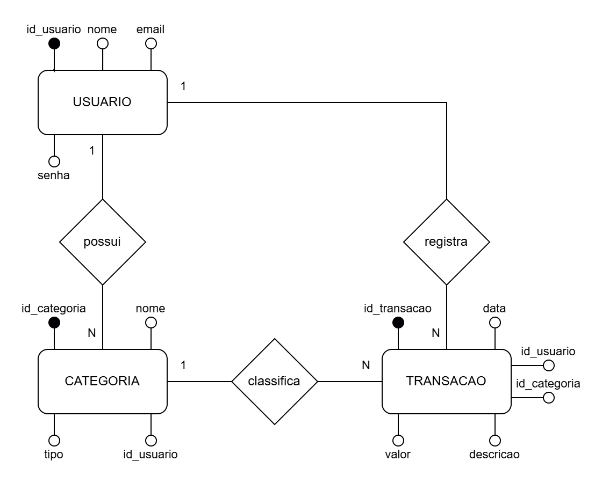

# Modelo Conceitual – Sistema MimAjuda

---

### USUARIO

**Motivo da existência**:  
Armazena as informações dos usuários cadastrados no sistema, garantindo que cada um tenha acesso aos seus próprios dados financeiros.

**Atributos**:
- `id_usuario` (PK) – Identificador único
- `nome` – Nome completo do usuário
- `email` – E-mail único usado para login
- `senha` – Senha criptografada

**Relacionamentos**:
- Um USUARIO pode ter várias CATEGORIAS
- Um USUARIO pode ter várias TRANSACOES

---

### CATEGORIA

**Motivo da existência**:  
Permite que o usuário classifique suas receitas e despesas por tipo, facilitando a organização e análise dos seus gastos.

**Atributos**:
- `id_categoria` (PK) – Identificador único
- `nome` – Nome da categoria (ex: Alimentação, Transporte)
- `tipo` – Receita ou Despesa
- `id_usuario` (FK) – Dono da categoria

**Relacionamentos**:
- Uma CATEGORIA pertence a um USUARIO
- Uma CATEGORIA pode estar associada a várias TRANSACOES

---

### TRANSACAO

**Motivo da existência**:  
Registra todos os lançamentos financeiros feitos pelos usuários, sejam receitas ou despesas, com informações detalhadas como valor, data, categoria e descrição.

**Atributos**:
- `id_transacao` (PK) – Identificador único da transação
- `data` – Data da transação
- `valor` – Valor monetário da transação
- `descricao` – Texto opcional explicando o lançamento
- `id_usuario` (FK) – Quem lançou a transação
- `id_categoria` (FK) – Categoria à qual pertence

**Relacionamentos**:
- Uma TRANSACAO pertence a um USUARIO
- Uma TRANSACAO pertence a uma CATEGORIA

---
