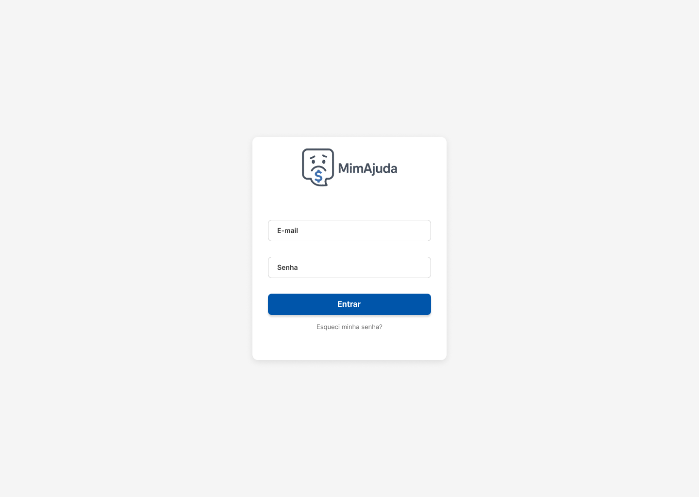
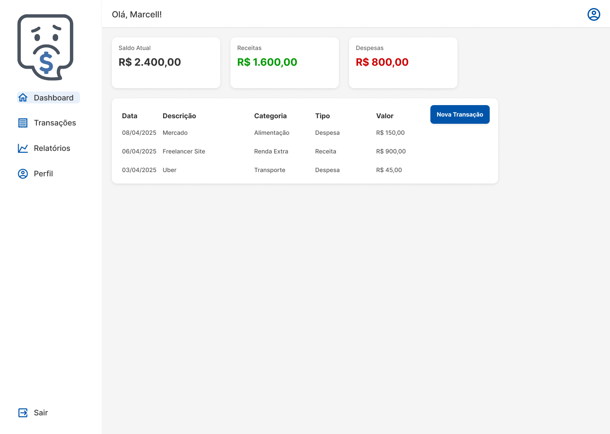
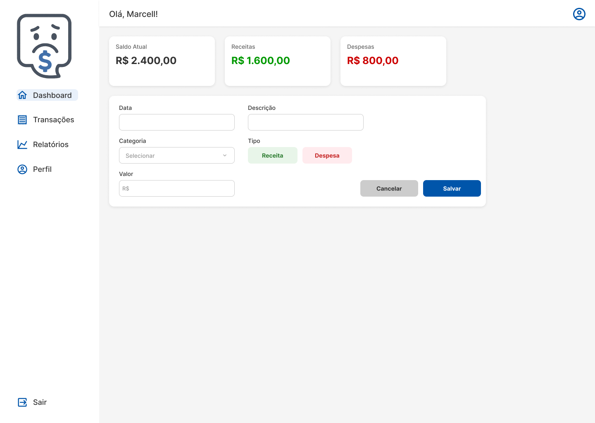
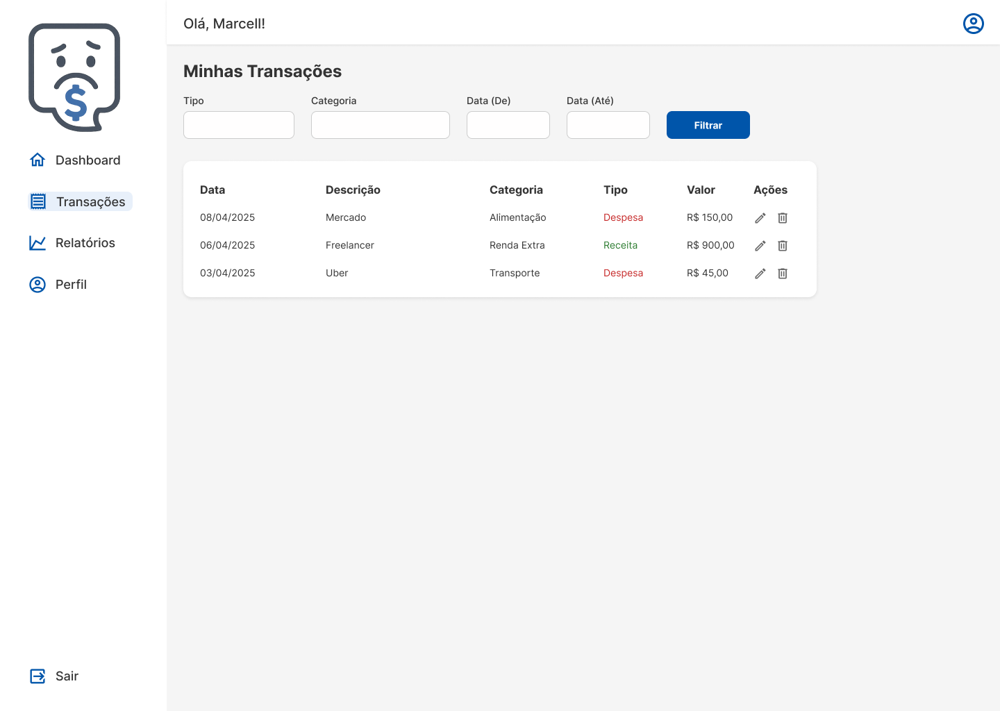
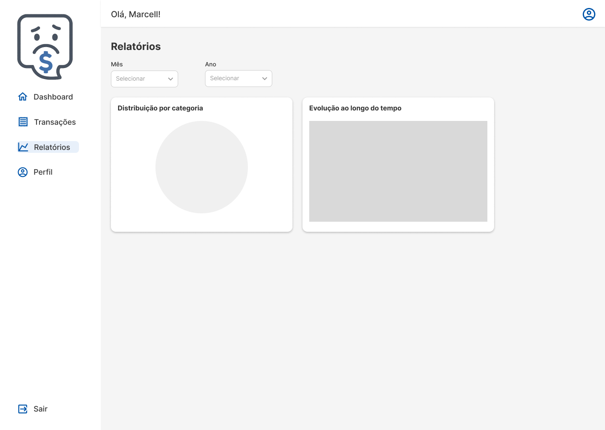
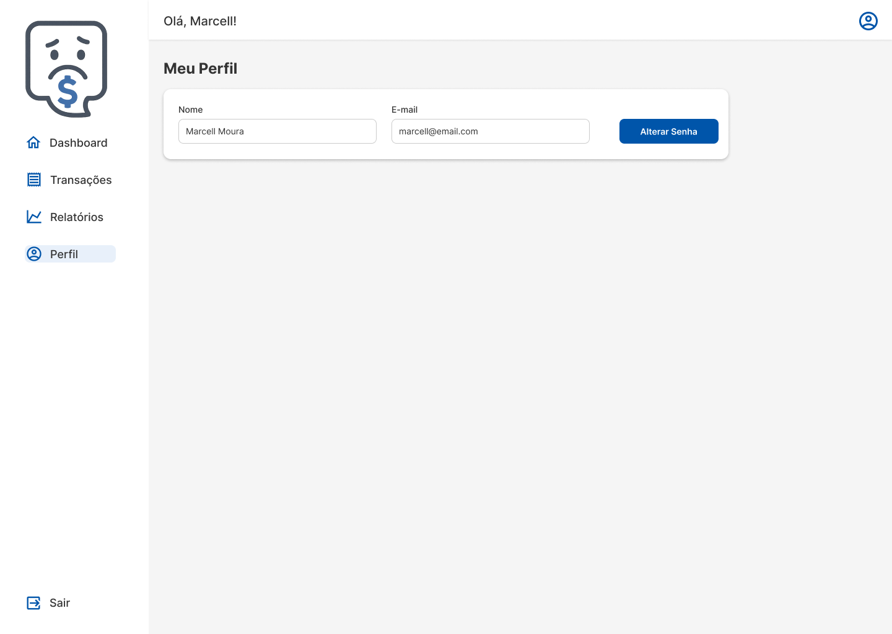
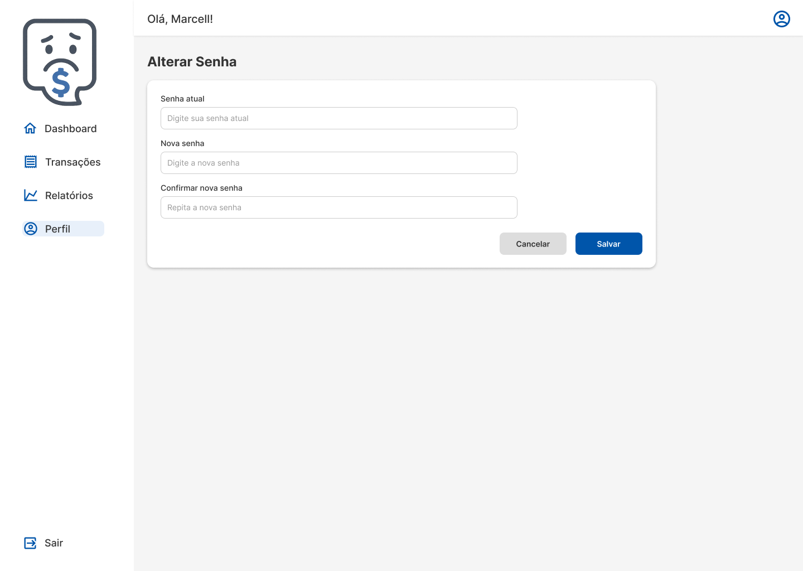

# Layout das Telas – MimAjuda

Este documento apresenta todas as telas do sistema MimAjuda, com capturas do protótipo desenvolvido no Figma e descrição da finalidade de cada uma.

---

## Tela de Login

**Descrição:**  
Tela inicial de autenticação do sistema. O usuário deve informar e-mail e senha para acessar sua conta.

**Imagem:**  

---

## Tela de Dashboard

**Descrição:**  
Apresenta o resumo financeiro do usuário com três cards principais (Saldo, Receitas e Despesas), além da listagem das transações mais recentes e botão para adicionar nova transação.

**Imagem:**  

---

## Formulário de Nova Transação

**Descrição:**  
Exibido no lugar da tabela ao clicar em "Nova Transação". Contém os campos para registrar uma nova entrada ou saída financeira.

**Imagem:**  

---

## Tela de Transações

**Descrição:**  
Tela dedicada à visualização detalhada do histórico de transações. Permite aplicação de filtros e oferece botões de edição e exclusão.

**Imagem:**  

---

## Tela de Relatórios

**Descrição:**  
Permite ao usuário visualizar gráficos baseados em suas receitas e despesas. Exibe um gráfico de pizza (distribuição por categoria) e um gráfico de linha (evolução ao longo do tempo).

**Imagem:**  

---

## Tela de Perfil

**Descrição:**  
Exibe os dados cadastrais do usuário. Contém botão para alteração de senha.

**Imagem:**  

---

## Tela de Alteração de Senha

**Descrição:**  
Formulário para atualizar a senha do usuário. Contém os campos: senha atual, nova senha e confirmação da nova senha.

**Imagem:**  

---

